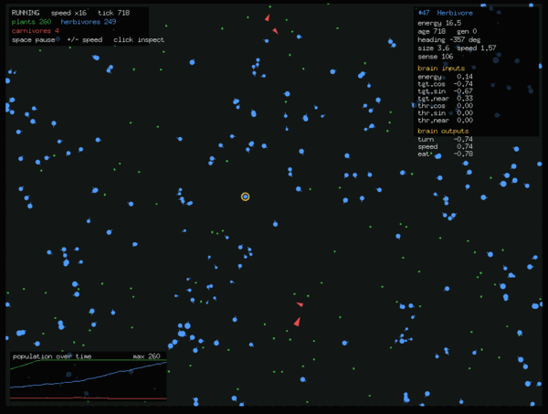

# Vivarium

A small 2D ecosystem simulation in Go + [Ebiten](https://ebitengine.org) where
agent **behaviour evolves** rather than being programmed. Each organism is steered
by a tiny hand-rolled neural network; there is no backpropagation — populations
improve purely through reproduction with mutation.



## The model

A toroidal (wrap-around) world with three trophic tiers:

| Tier | Drawn as | Eats | Eaten by |
| --- | --- | --- | --- |
| Plants (food) | green dots | — | herbivores |
| Herbivores | blue circles | plants | carnivores |
| Carnivores | red triangles | herbivores | — |

Every agent has an energy budget. Energy drains each tick (a basal cost) and with
movement; eating restores it. At zero energy the agent dies. Plants regrow energy
over time toward a cap.

## The brain

Each agent's behaviour comes from a recurrent neural net (19 inputs → 12 hidden →
4 outputs, `tanh` activations), implemented from scratch with flat `float64`
slices — no ML libraries. The hidden layer feeds its previous activations back in
(an Elman-style memory), so an agent can act on the recent past — keep fleeing for
a moment after a predator drops out of range, wander, etc. — rather than reacting
to the current senses alone. Offspring inherit the weights but start with a blank
memory.

**Inputs:** directional **vision** — a ring of 6 sectors around the agent (sector 0
points straight ahead), each carrying the proximity of the nearest *target* (food
for herbivores, prey for carnivores), the nearest *threat* (a predator), and the
*voice* (signal) of the nearest same-kind neighbour — plus the agent's own
normalised energy. Three channels × 6 sectors + 1 = 19 inputs.

**Outputs:** turn, speed, an eat/act decision, and a broadcast signal.

## Evolution

When an agent's energy crosses a threshold it reproduces, splitting its energy with
an offspring whose genome (brain weights) and traits — **size, max speed, sense
radius, learning rate, curiosity, diet** — are inherited with small Gaussian
mutations. Reproduction is **sexual** by default (`sexual`): a breeding agent that
finds a mature same-kind partner within `mateRadius` produces a child by **uniform
crossover** of the two parents' genomes and traits (each gene/trait drawn at random
from one parent); with no mate nearby it falls back to asexual cloning. Only the
initiating parent pays the energy cost, so the energy economy is unchanged. Over
generations the population drifts toward viable strategies: foraging, seeking, and
fleeing.

## In-lifetime learning

Evolution only changes brains *between* generations. On top of it, each brain also
**learns during its own life**: every tick the change in energy (eating rewards,
costs/harm penalise) drives a **reward-modulated Hebbian** update of a working copy
of the weights, reinforcing whatever activity preceded reward. An advantage signal
(reward minus a running baseline) keeps routine ticks from biasing the weights, and
weights are clamped so the unsupervised rule can't run away.

How much an agent learns is set by its evolved **`Plasticity`** trait (0 = a fixed,
non-learning brain) — so evolution itself decides how plastic each lineage should
be. Learning is **Baldwinian**: offspring inherit the *genome* (birth weights), not
what a parent learned, so every individual must learn anew. This keeps the two
adaptation processes separate and lets you watch the classic **Baldwin effect** —
the ability to learn being selected for. The inspector shows each agent's
`plasticity`, its current `reward`, and `learned` (how far lifetime learning has
moved its weights from the inherited genome).

## Curiosity

Reward isn't only about food. Each agent also trains a small **forward (world)
model** — a linear predictor learned online by **gradient descent** — that predicts
its *next* senses from its current senses and chosen action. The model's prediction
error is the **surprise** of a transition, and it's added (scaled by the evolved
**`Curiosity`** trait) to the reward that drives learning. The effect is *intrinsic
motivation*: agents are nudged toward novel, not-yet-predictable situations rather
than only chasing energy. Because the model keeps learning, surprise in a
well-explored region fades and curiosity moves on — the standard intrinsic-reward
dynamic. The inspector shows each agent's `curio` (trait) and live `surprise`.

### Communication

Every agent **broadcasts a scalar signal** (its 4th brain output), and hears the
signal of the nearest same-kind neighbour in each vision sector through a third
"voice" channel. Signals are **double-buffered** — promoted together at the end of
each tick — so every agent hears the *previous* tick's broadcast regardless of
update order, keeping the channel order-independent and deterministic.

Nothing rewards signalling on its own; the channel is just wired into the evolving,
learning brains, so communicative strategies (alarm calls, flocking, coordinated
movement) can *emerge* if they pay off. Active broadcasts are visible in-world as a
faint **halo** — warm for a positive signal, cool for a negative one (toggle with
`h`) — and the inspector shows the incoming `voices` channel and the agent's own
`signal` output.

## Population stability

Naïve predator–prey agent worlds tend to collapse: carnivores overshoot, eat every
herbivore, then starve all at once. Three mechanisms damp this into coexistence:

- **Predator metabolism** — carnivores burn energy ~3x faster than herbivores, so
  when prey is scarce they decline quickly instead of lingering.
- **Gestation cooldown** — a kill can't be turned into an instant litter; predators
  also reproduce more slowly than prey (as in real food webs), and an energy cap
  stops a big meal from being hoarded into many births.
- **Rescue effect** (`-rescue`, on by default) — if a tier nears extinction, rare
  immigrants arrive (descended from survivors when any remain, so evolution
  continues), modelling a metapopulation rescue. Pass `-rescue=false` for the raw,
  collapse-prone dynamics.

## Environment

The world is more than an empty plain — four environmental systems add structure
and time-varying pressure (all tunable in the config, set to 0 to disable):

- **Seasons** — a slow sinusoidal cycle scales plant regrowth between scarcity and
  plenty (`seasonLength`, `seasonAmplitude`), driving boom/bust resource swings.
- **Day/night** — a faster cycle scales every agent's *effective vision range* down
  toward `nightVision` at night, so agents periodically go half-blind — pressure for
  caution, memory, and signalling. The background dims at night and the HUD shows
  the current `season`/`light` levels.
- **Terrain** — `obstacles` impassable rocks are scattered at world start; agents
  can't move into them (but can always escape if pushed in), and rocks **block line
  of sight** (sight only — sound still carries), creating blind corners and ambush
  spots, carving the plain into spaces to navigate.
- **Multiple food types** — plants come in two types (different colours). Herbivores
  evolve a **`Diet`** trait that sets which type they digest efficiently; they
  perceive food weighted by edibility and gain little from a mismatched plant, so
  dietary specialists and niches can emerge.

## Controls

| Key / action | Effect |
| --- | --- |
| `space` | pause / resume |
| `+` or `=` | double simulation speed |
| `-` | halve simulation speed |
| left click | select the nearest agent and open its inspector |
| `g` | toggle the **species view** (genome clustering + PCA map) |
| `l` | toggle the **lineage view** (lineage colouring + abundance-over-time chart) |
| `p` | toggle the **phylogeny view** (coalescent genealogy tree of the living population) |
| `h` | toggle the communication **halos** around broadcasting agents |
| `s` | save the current population to a snapshot file |
| mouse wheel | zoom the camera toward the cursor |
| arrow keys | pan the camera |
| `0` | reset the camera (whole world, no zoom) |

The HUD shows run state and live counts, a line chart tracks plant/herbivore/
carnivore counts over time, and the inspector shows a selected agent's energy, age,
generation, traits, and current neural inputs/outputs.

## Species analytics

Press `g` to toggle a built-in machine-learning view of the population (all
hand-rolled in [`internal/analytics`](internal/analytics), no ML libraries):

- **k-means clustering** groups agents into emergent "species" by their
  brain-**genome** vector. Successful lineages — whose descendants share nearly the
  same genome — form tight clusters, so the clustering effectively discovers them.
- Agents in the world are recoloured by their species, and a panel shows each
  cluster's size plus a **2D PCA projection** of genome-space (top two principal
  components, found by power iteration), so you can *see* the population spread out
  and speciate.

Both run read-only over the simulation on a throttle with their own RNG, so they
never affect a run's determinism.

Press `l` for the complementary **lineage view**. Every agent carries a
`LineageID` — the founding ancestor it descends from (offspring inherit it;
founders and rescue immigrants start new lineages). The view colours agents by
lineage and draws a **stacked abundance-over-time chart** of the most prominent
lineages (the rest lumped into grey "other"), so you can watch lineages arise,
sweep, and go extinct — the *how* behind the species snapshot.

Press `p` for the **phylogeny view**. The simulation retains a genealogy of every
birth (`parent -> child`), continuously pruned to just the ancestors of living
agents — i.e. the **coalescent tree** of the current population. The view samples
living agents as leaves, traces them back to their common ancestors, and draws the
family tree as a dendrogram with **time on the x-axis** (founders left, now right),
branches coloured by lineage — so you can see where today's population coalesces and
which ancestral splits gave rise to it.

## Running

```sh
go run ./cmd/vivarium            # default run
go run ./cmd/vivarium -seed 42   # reproducible run
```

All randomness is drawn from a single seeded generator, so a given `-seed`
reproduces the same run exactly.

### Headless runs

For long offline experiments there's a separate **headless** binary that runs the
simulation with no GUI (it imports only the sim core — no Ebiten, no display) and
streams CSV statistics, so it starts instantly and is easy to redirect and plot:

```sh
go run ./cmd/vivarium-headless -seed 1 -ticks 20000 -every 200 > run.csv
go run ./cmd/vivarium-headless -config myconfig.json -ticks 50000 > run.csv
go run ./cmd/vivarium-headless -print-config > config.json   # display-free
```

Each row reports the tick, the three population counts, mean/max generation, the
mean of each evolved trait (size, speed, sense, plasticity, curiosity), mean
lifetime learning drift, and the number of distinct living lineages — so you can
watch selection and adaptation over far longer runs than the interactive view. Runs
are deterministic for a given seed and config.

For larger worlds the per-tick cost is dominated by each agent's vision + neural
nets, which is read-only on shared state; that phase runs **in parallel across CPU
cores** (with the movement/eating phase kept sequential for deterministic results),
so big populations step several times faster on a multi-core machine.

### Saving & loading populations

An evolved population can be snapshotted to a JSON file (genomes, traits, terrain,
genealogy) and reloaded to seed a new run — resume a long experiment, share an
interesting population, or branch off variants:

```sh
go run ./cmd/vivarium-headless -ticks 50000 -save evolved.json   # run, then save
go run ./cmd/vivarium-headless -load evolved.json -ticks 20000   # continue evolving
go run ./cmd/vivarium -load evolved.json                         # explore it in the GUI
```

In the GUI, press `s` to save the current population (to `-snapshot`'s path,
default `vivarium-snapshot.json`). Loading reconstructs every brain from its saved
genome and preserves generation/lineage, so the analytics views stay coherent.
Loading isn't a bit-exact resume — the RNG stream and learned (in-life) state are
not stored — but the heritable population is reproduced exactly.

### Flags

| Flag | Default | Description |
| --- | --- | --- |
| `-seed` | 1 | random seed |
| `-width`, `-height` | 960, 720 | world size in pixels |
| `-plants` | 200 | initial plant count |
| `-herbivores` | 80 | initial herbivore count |
| `-carnivores` | 8 | initial carnivore count |
| `-rescue` | true | immigration when a tier nears extinction (set `false` for raw dynamics) |
| `-config` | — | path to a JSON config file overriding defaults |
| `-print-config` | — | print the default config as JSON and exit |

### Tuning the ecosystem

Beyond the population/size flags, the ecological, metabolic, and learning scalars —
metabolism costs, reproduction threshold, mutation rate, food regrowth, predation
gains, learning rates, etc. — are exposed as a JSON config so you can tune a run
**without recompiling**. Grab a template and edit it:

```sh
go run ./cmd/vivarium-headless -print-config > myconfig.json   # or copy docs/config.example.json
go run ./cmd/vivarium -config myconfig.json
```

Config files may be **partial** — only the fields you include are overridden,
everything else keeps its default. Precedence is: built-in defaults → config file →
explicitly-set CLI flags. The full default config (every tunable) is committed at
[`docs/config.example.json`](docs/config.example.json). Morphological trait ranges
(size/speed/sense bounds) remain compile-time, since they're the search space
evolution explores.

> On Linux you need the usual Ebiten build dependencies (OpenGL + X11 dev headers,
> e.g. `libgl1-mesa-dev xorg-dev libxxf86vm-dev libasound2-dev`).

## Layout

```
cmd/vivarium          GUI entry point: flags, seeding, window setup
cmd/vivarium-headless  no-GUI runner: CSV stats for offline experiments
internal/geom       2D vectors + toroidal math
internal/neural     hand-rolled recurrent brain + world-model (+ tests)
internal/sim        World, Agent, Food, Traits, evolution + learning (+ tests)
internal/analytics  hand-rolled k-means + PCA for the species view (+ tests)
internal/render     Ebiten game loop, drawing, overlays, input
```

The `geom`, `neural`, `sim`, and `analytics` packages are pure Go with no Ebiten
dependency, so the simulation core is unit-testable headlessly: `go test ./internal/...`.

## Related work

- [Polyworld](https://github.com/polyworld/polyworld)
- [The Bibites](https://www.thebibites.com/)
- [Karl Sims' Evolved Virtual Creatures](https://en.wikipedia.org/wiki/Karl_Sims)
- [Framsticks](https://www.framsticks.com/)
