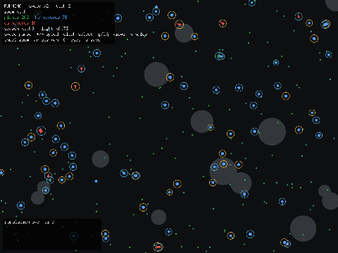

# vivarium

> *An ecosystem where behaviour evolves.*

[](https://github.com/danielriddell21/vivarium/actions/workflows/ci.yaml)
[](https://go.dev)
[](LICENSE)

A 2D ecosystem simulation in Go + [Ebiten](https://ebitengine.org) where agent
**behaviour evolves** rather than being programmed. Each organism is steered by a
tiny hand-rolled neural network; there is no backpropagation between generations —
populations improve through reproduction with mutation (and adapt within a lifetime
through reward-driven learning).



**→ See [docs/demos.md](docs/demos.md) for the full feature gallery with
screenshots.**

## Highlights

- **Evolving recurrent neural brains** (19→12→4, hand-rolled, no ML libraries) with
  directional vision, memory, and a communication channel.
- **Sexual reproduction** with genome crossover; co-evolving morphology and diet.
- **In-lifetime learning** (reward-modulated Hebbian) and **curiosity** (a forward
  world-model trained by gradient descent for intrinsic reward).
- **Living environment** — seasons, day/night vision cycles, terrain that blocks
  movement and sight, and multiple food types that drive dietary niches.
- **Analytics views** — k-means + PCA species clustering, lineage abundance, and a
  coalescent phylogeny tree, all hand-rolled.
- **Tooling** — pan/zoom camera, tunable JSON config, a headless CSV runner for
  offline experiments, and population save/load.

## Quick start

```sh
go run ./cmd/vivarium             # run the GUI
go run ./cmd/vivarium --seed 42    # reproducible run
```

> On Linux you need the usual Ebiten build dependencies (OpenGL + X11 dev headers,
> e.g. `libgl1-mesa-dev xorg-dev libxxf86vm-dev libasound2-dev`).

All randomness comes from a single seeded generator, so a given `--seed` reproduces
the same run exactly.

## Controls

| Key / action | Effect |
| --- | --- |
| `space` | pause / resume |
| `+` / `-` | faster / slower simulation |
| left click | select the nearest agent (opens the inspector) |
| `g` / `l` / `p` | species / lineage / phylogeny analytics views |
| `h` | toggle communication halos |
| `s` | save the current population to a snapshot |
| mouse wheel / arrows / `0` | zoom / pan / reset the camera |

## Configuration

The population/size flags (`--plants`, `--herbivores`, `--carnivores`, `--width`,
`--height`, `--rescue`, `--seed`) cover the basics. The ecological, metabolic, and
learning scalars are exposed as a **JSON config** so a run can be tuned without
recompiling:

```sh
go run ./cmd/vivarium headless --print-config > myconfig.json   # template (display-free)
go run ./cmd/vivarium --config myconfig.json
```

Config files may be partial (unspecified fields keep their defaults); the full
default is committed at [`docs/config.example.json`](docs/config.example.json).

## Headless runs & snapshots

The **`headless`** subcommand runs the sim with no GUI (no Ebiten/display) and
streams CSV statistics — ideal for long offline experiments. Populations can be
saved to disk and reloaded to resume, share, or seed runs:

```sh
go run ./cmd/vivarium headless --ticks 50000 --every 200 --save evolved.json > run.csv
go run ./cmd/vivarium headless --load evolved.json --ticks 20000               # continue
go run ./cmd/vivarium --load evolved.json                                     # open in the GUI
```

## Layout

```
cmd/vivarium           CLI entry point (GUI by default; `headless` subcommand)
internal/cli           Cobra root, the headless subcommand, and completion
internal/geom          2D vectors + toroidal math
internal/neural        hand-rolled recurrent brain + world-model
internal/sim           World, Agent, evolution, learning, environment
internal/analytics     hand-rolled k-means + PCA for the species view
internal/render        Ebiten game loop, drawing, overlays, input
```

`geom`, `neural`, `sim`, and `analytics` are pure Go with no Ebiten dependency, so
the simulation core is unit-testable headlessly: `go test ./...`.

## Documentation

- [Demos](docs/demos.md)
- [Example config](docs/config.example.json)

## Related work

[Polyworld](https://github.com/polyworld/polyworld) ·
[The Bibites](https://www.thebibites.com/) ·
[Karl Sims' Evolved Virtual Creatures](https://en.wikipedia.org/wiki/Karl_Sims) ·
[Framsticks](https://www.framsticks.com/)
