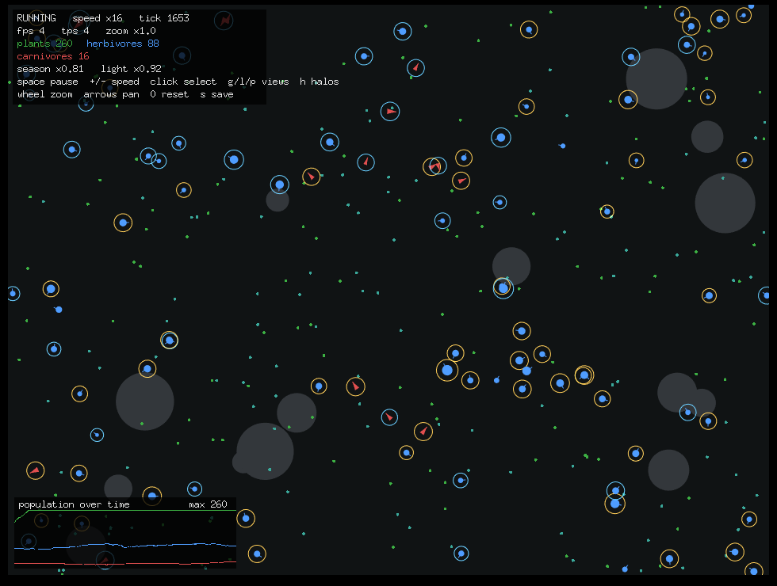
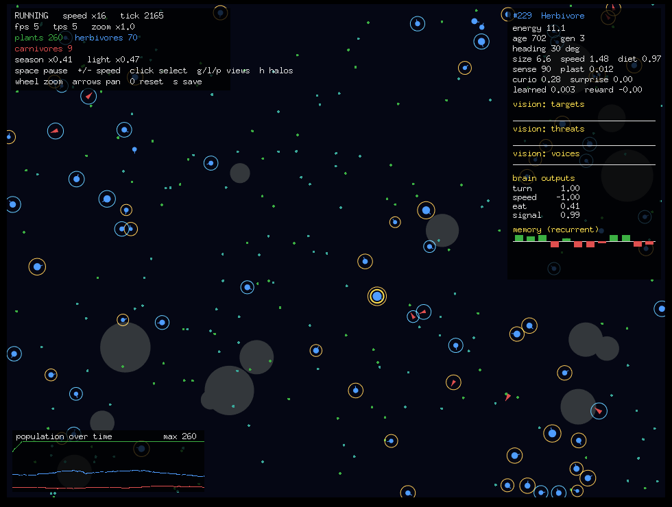
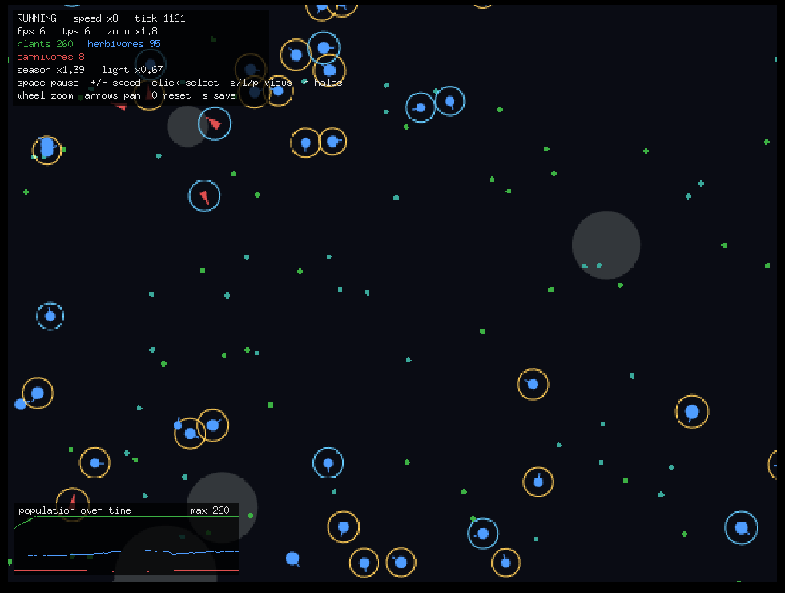
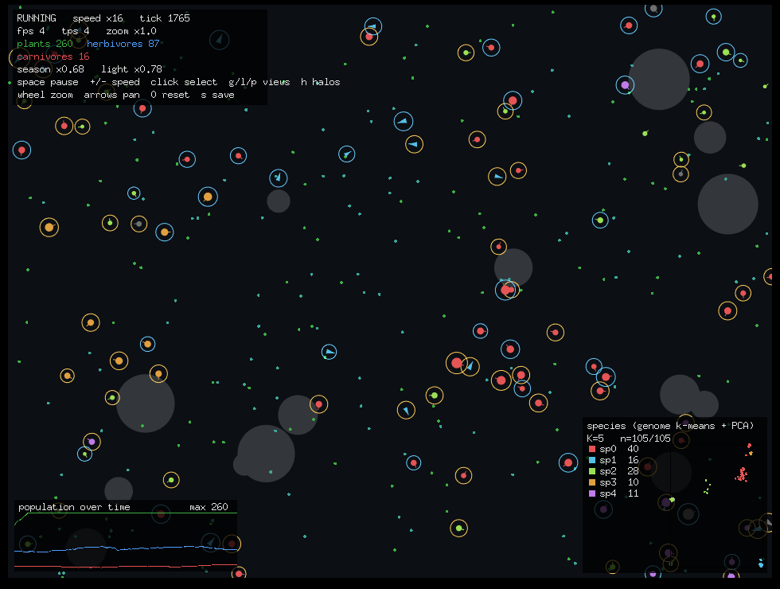
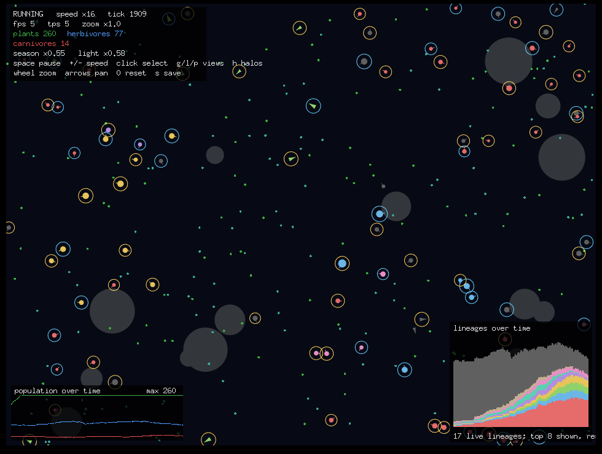
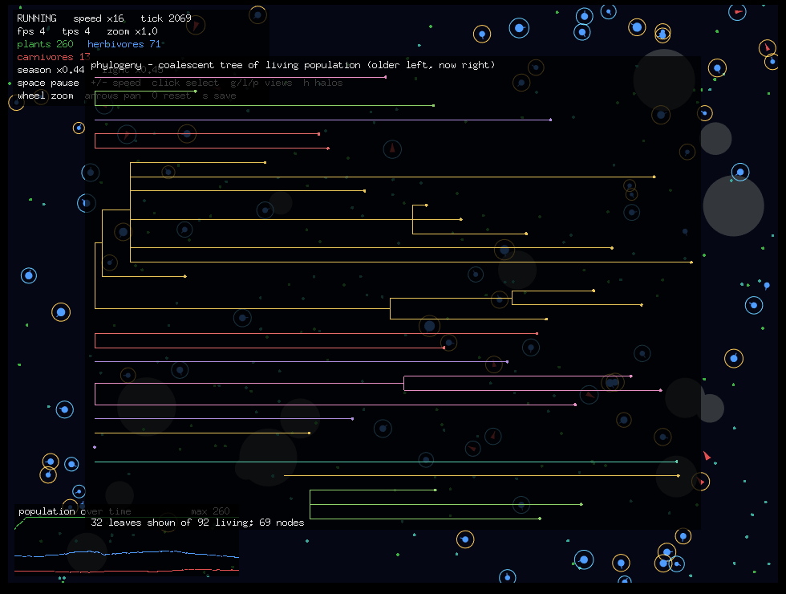

# Vivarium — feature gallery

A visual tour of what the simulation does. See the [README](../README.md) for build
and run instructions.

*The living world: green/teal dots are two plant types, blue circles are herbivores,
red triangles are carnivores. Gray discs are terrain. Coloured rings are agents
broadcasting a signal.*

---

## The ecosystem

A toroidal (wrap-around) plane with three trophic tiers — regenerating **plants**,
**herbivores** that eat them, and **carnivores** that hunt herbivores. Every agent
spends energy each tick (basal cost + movement) and dies at zero; eating restores
it. Predator–prey dynamics are kept from collapsing by predator metabolism, a
reproduction cooldown/energy cap, and an optional **rescue effect** (rare
immigrants when a tier nears extinction).

## The brain

Each agent is driven by a tiny hand-rolled **recurrent neural net** (19 inputs →
12 hidden → 4 outputs, `tanh`, no ML libraries). The hidden layer feeds its
previous activations back in (Elman-style memory). Inputs are **directional
vision**: a ring of 6 sectors, each carrying the proximity of the nearest *target*
(food/prey), nearest *threat* (predator), and the *voice* of the nearest same-kind
neighbour, plus the agent's energy. Outputs are turn, speed, eat, and a broadcast
signal.

## Evolution, learning & curiosity

- **Evolution** — reproduction passes on the genome (brain weights) and traits
  (size, speed, sense radius, learning rate, curiosity, diet) with small
  mutations. Reproduction is **sexual** by default: a nearby mate yields a
  crossover of both parents, otherwise an asexual clone.
- **In-lifetime learning** — a reward-modulated **Hebbian** rule adapts a working
  copy of the weights from energy reward during life; the evolved `Plasticity`
  trait sets the rate. Learning is **Baldwinian** (offspring inherit the genome,
  not what a parent learned).
- **Curiosity** — each agent trains a small **forward model** (online gradient
  descent) predicting its next senses; the prediction error becomes an intrinsic
  reward, scaled by the evolved `Curiosity` trait — exploration for its own sake.

Click any agent to open the inspector: energy, age, generation, traits, live
vision channels, brain outputs, and recurrent memory.

## Communication

Agents broadcast a scalar **signal** that same-kind neighbours hear through a
"voice" vision channel — a substrate for emergent alarm calls / flocking. Active
broadcasts show as faint **halos** (warm = positive, cool = negative).

## Environment

Four environmental systems add structure and time-varying pressure (all tunable,
0 disables):

- **Seasons** — a slow cycle scales plant regrowth (boom/bust).
- **Day/night** — a faster cycle shrinks effective vision at night (the world dims).
- **Terrain** — impassable rocks block both movement and **line of sight**.
- **Food types** — two plant types; herbivores evolve a `Diet` trait and so can
  specialise into niches.

*Close-up (zoomed in): terrain rocks, both food colours, signalling halos, and the
dimmed night-time tint.*

## Analytics views

Built-in, hand-rolled machine-learning views of the population (no ML libraries):

### Species — `g`
k-means clusters the population in brain-**genome** space (so it discovers
lineages that share a genome), recolours agents, and shows a 2D **PCA** map.

### Lineage — `l`
A stacked **abundance-over-time** chart of the most prominent lineages, with agents
coloured by lineage — watch lineages rise, sweep, and go extinct.

### Phylogeny — `p`
The **coalescent genealogy tree** of the living population: leaves traced back
through shared ancestors, time on the x-axis, branches coloured by lineage.

